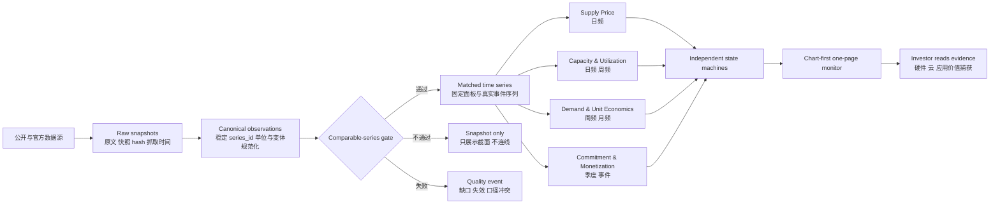

# AI Compute Tracker Project Reframe | 2026-07-10

## 结论

这个项目不应该继续被定义为“把更多公开数据画到一页上”。它应该被重新定义为：

> 一个面向二级市场投资者的 AI Compute Economics Monitor，用独立频率的证据链追踪算力供需、云厂商投入与变现、模型单位经济、应用商业化，并暴露真正的趋势拐点。

当前代码中最值得保留的是采集器、原始快照、来源追溯、生产/seed 隔离和部分解析测试。当前 UI、旧 CSI、`No Signal / 15%` 决策引擎、以及把稀疏横截面包装成趋势的图表不应继续作为产品基础。

## 一、当前项目诊断

### 1. 项目身份漂移

工作区中同时存在：

- 旧静态 `compute-tracker`。
- 5,599 行的 Streamlit `dashboard_v2.py`。
- 后来的单页 HTML `ai_compute_trend_board.html`。
- 旧 L1/L2/L3/CSI demo 决策逻辑。
- 新 `production_market_facts` 四轨数据。

结果是数据、判断和界面没有单一权威入口。README 仍保留大量旧截图、旧入口和旧结论，项目维护成本高，用户也无法判断哪个版本代表产品。

### 2. 行数不等于趋势数据

截至 2026-07-08，生产库有 `18,135` 行市场事实，但：

| 审查项 | 当前结果 | 对产品的影响 |
|---|---:|---|
| `token_price` 行数 | 14,383，占 79.3% | 大量 catalog 横截面放大了总行数 |
| token 单序列最大日期数 | 3 | 没有任何序列达到 5 个日期，不能称为价格趋势 |
| GPU rental 聚合日期 | 26 | 同一 provider/variant 最多只有 4 个日期，当前中位线存在样本构成漂移 |
| `gpu_rental_trend` | 3 个 GPU、各 10 日 | 是当前最接近可比短期趋势的 GPU 数据，但历史仍短 |
| OpenRouter activity proxy | 13 个周点 | 最新 2026-07-06 周为未完成周，当前图尾部急跌会误导 |
| CAPEX actual | 5 家各 1 个季度 | 只能显示当前事实，不能形成公司自身 CAPEX 趋势 |
| 质量事件 | 125 行、23 个 affected keys | 历史失败重复展示，审计表噪音过高 |
| 完整语义重复 | 477 行、166 个 key | 需要在 canonical 层去重 |

### 3. 已确认的数据表达问题

1. RunPod 当前聚合把不可用的 `$0` 价格放入最低价，也把 B300 MIG 切片归入整卡 B300。
2. GPUMarkets 原始数据有 1D/7D/30D delta，但 HTML 查询按不同 `dimension` 分组，导致页面显示 `30D n/a`。
3. GPU rental 图每天的 provider、variant、GPU count 和 billing type 构成不同，当前 median 变化不能直接解释为市场价格变化。
4. token price 图只要求两个日期就画折线，不能支撑“趋势拐点”。
5. ARR.club 两个抓取日重复同一公开值，不是 ARR 历史。
6. OpenRouter 周频 proxy 没有剔除未完成周。
7. `DecisionEngine` 主要读取 `production_gpu_prices`、CAPEX 和 official events，不读取新增的 `production_market_facts`；因此 `No Signal / 15%` 与当前 18,135 行市场事实并不在同一决策闭环内。
8. 当前验收强调图表数量、SVG 数量、控制台无错误和移动端不溢出，但没有验证“曲线是否由可比样本构成”。

## 二、项目构思

### 1. 产品定义

暂定名称：`AI Compute Economics Monitor`

目标用户：以美股/全球科技股为主的二级市场投资者。

核心用途：

1. 判断算力租赁价格和可用深度是否出现真实、广泛、持续的松动。
2. 判断云厂商是供给仍紧、开始盘活闲置算力，还是出现资本开支纪律变化。
3. 判断模型推理价格下降是否伴随调用量增加，从而区分需求弹性与价值破坏。
4. 判断应用商业化是否接棒基础设施投入，支持价值捕获从硬件向云和应用迁移。
5. 把以上证据映射到硬件、网络/电力/数据中心、Hyperscaler、Neocloud、模型与应用层，但不自动输出买卖建议。

### 2. 四个独立时钟

不同频率不混权重、不插值成同一指数。

| 时钟 | 主要问题 | 频率 | 主数据 | 输出 |
|---|---|---|---|---|
| Supply Price | 算力价格是否松动 | 日频/快照 | GPUMarkets、RunPod、Vast、GPUPerHour、ComputePrices | 可比价格曲线、订单簿深度、代际价差 |
| Capacity & Utilization | 低价是否伴随可用供给扩大 | 日频/周频 | offers、stock status、capacity proxy、cloud spot | 供给深度、可用率、价差分布 |
| Demand & Unit Economics | 模型降价是否换来更多使用 | 周频/月频/事件 | OpenRouter usage、模型 list price、质量 proxy、Seedance 成本 | 调用量、单位成本、价格变更事件 |
| Commitment & Monetization | CAPEX/RPO/ARR 是否确认 | 季度/事件 | SEC、官方 guidance/RPO、Ramp、ARR source-backed events | CAPEX 轨迹、指引修订、商业化事件 |

每个时钟只输出自己的状态：

- `Unobservable`：缺数据或口径不可比。
- `Observing`：有真实数据，但历史不足。
- `Trend`：可比序列达到最低覆盖门槛。
- `Inflection Watch`：统计变化和市场广度同时触发。
- `Confirmed`：后续频率层出现官方或商业化确认。

不再输出一个总分或固定 `15% confidence`。

### 3. 产品核心不是“更多图”，而是“可比序列”

每条可画曲线必须有稳定 `series_id`，至少包括：

- source / venue
- GPU family 与 exact variant
- full GPU / MIG
- memory
- billing type
- commitment
- region
- GPU count
- currency
- unit basis：GPU-hour / VM-hour / 1M tokens / request / credit
- price type：ask / fixing / list / spot / reserved / transaction

只有同一个 `series_id` 的连续观测才能直接连线。跨 provider 的市场指数必须使用固定样本面板或明确的 repeat-sales/matched-panel 方法，不能每天对不同样本直接取 median。

### 4. 第一版应回答的六个问题

1. H100、H200、B200 的 matched-panel 租赁价格 7D/30D 变化是什么？
2. 价格下降时，可用 offer 数、P25/P50/P75 和最大可租数量是否同时上升？
3. RunPod、Vast、GPUPerHour、官方云的价差是在收敛还是扩大？
4. 旗舰模型 output token list price 是否发生真实变更？变更后调用量是否上升？
5. Anthropic、OpenAI、Seedance 等商业化事件是否持续上修，而不是重复抓取同一个数字？
6. 五家美国云厂商及核心中国厂商的 CAPEX/guidance/RPO 是否出现负向修订？

### 5. 页面构思

继续使用单页，但只保留六个核心展项和一个按需展开的方法/质量抽屉。

| Section | 主图 | 图形 | 默认信息 |
|---|---|---|---|
| Compute Price | H100/H200/B200 matched-panel index | 三个 small multiples，起点=100 | 7D/30D、覆盖率、来源数 |
| Market Depth | 各 venue 的价格分布与 offer 深度 | 区间点图 + depth bar | P25/P50/P75、offers、capacity |
| Cloud | AWS/Azure/GCP 同规格实例 | provider small multiples | VM-hour，不与 GPU-hour混算 |
| Model Economics | 核心模型 output price change log | step chart | 只显示真实价格变更事件 |
| Demand | OpenRouter/其他可验证 usage | 周线 + 4 周均线 | 自动剔除未完成周 |
| Commitment | CAPEX/guidance/RPO/ARR events | 季度柱 + 事件轨道 | 不做日频插值 |

视觉原则：Apple 式清楚、安静、留白；白/浅灰为主，一种主强调色；section 用间距、标题和细分隔线划分；不使用黑色营销 hero；来源、频率、覆盖率放在图表脚注；完整错误日志只在抽屉里查看。

## 三、概念图

## 四、保留、归档、重建

| 处理 | 内容 | 原因 |
|---|---|---|
| 保留 | `data_sources/*`、raw snapshots、production provenance、SEC/官方事件采集、seed 隔离、解析测试 | 这是当前最有价值的工程资产 |
| 保留并修复 | DuckDB、quality events、GPUMarkets/Vast/RunPod/GPUPerHour/OpenRouter 等采集器 | 数据是真实的，但规范化和质量门不足 |
| 归档 | 旧 `compute-tracker`、Streamlit 五 tab UI、旧截图堆栈 | 不再作为产品入口 |
| 停用 | L2/L3/CSI demo、CAPEX 日频插值、旧 `No Signal / 15%` 决策输出 | 与用户“不混频”的原则冲突，且不读取新数据闭环 |
| 重建 | canonical series schema、matched-panel engine、change-point rules、HTML extract、单页 UI | 这是形成真实趋势产品的必要基础 |

## 五、项目计划

### Phase 0：收敛项目身份

周期：1-2 天。

动作：

- 指定 `tracker_v2` 为唯一项目目录。
- 指定一个 production DB 和一个 production dashboard。
- 将旧 Streamlit、静态 tracker、legacy CSI 标记为 archive/demo。
- 精简 README，只保留当前入口、数据合同、运行方式和已知限制。

验收：新成员在 5 分钟内能确认唯一入口、唯一数据库和唯一数据合同。

失败暴露：启动命令若指向旧 DB 或旧 UI，测试直接失败。

### Phase 1：数据质量止血

周期：3-5 天。

动作：

- 修复 RunPod `$0`、MIG/full GPU、variant 和 availability 过滤。
- 修复 GPUMarkets delta join。
- 对 477 个语义重复行建立确定性去重键。
- 质量事件默认只显示每个 affected key 最新状态，历史留在审计日志。
- 把未完成周、过期快照、catalog 缺价与真实零价分开。

验收：

- production price 行 `value <= 0` 为 0，除非指标明确允许零且有原因码。
- MIG 不进入 full-GPU series。
- canonical key 重复为 0。
- GPUMarkets 30D delta 与原 CSV 一致。
- incomplete weekly period 不进入趋势图。

失败暴露：不合格行进入 quarantine，不进入图表 extract。

### Phase 2：建立可比序列层

周期：4-6 天。

动作：

- 新增 `series_definition`、`canonical_observation`、`series_quality`、`event_observation`。
- 为 GPU、cloud VM、model price、usage、CAPEX event 建立稳定 `series_id`。
- 建立 matched-panel 市场指数；固定 provider/variant/billing 组成后再计算指数。
- 只在同序列观测达到门槛后生成 line-ready view。

验收：

- 每条曲线可以回溯到固定 series 组成。
- GPU 日线至少 10 个有效日期才可显示短期趋势；30D inflection 至少 20 个有效交易/抓取日且覆盖率 >=80%。
- 90D 判断至少 60 个有效日。
- 少于门槛的内容只能显示 snapshot/point/event，不连线。

失败暴露：每条 series 返回 `eligible_for_chart`、`eligible_for_inflection` 和具体 reason code。

### Phase 3：历史回填与持续采集

周期：首轮 7-14 天；之后持续运行。

动作：

- 对可合法回填的源补历史。
- 对不能回填的 RunPod/Vast/GPUPerHour/云价格从现在开始每日定时快照。
- OpenRouter 官方 token/app usage 在获得 key 后接入；此前 proxy 只能作为独立弱证据。
- CAPEX/guidance/RPO 只按季度和事件追加，不做日频插值。

验收：采集 SLA、缺失日、源变更、限流和 stale 状态均有自动监控。

失败暴露：连续失败不会静默沿用旧值；旧值必须带 stale age。

### Phase 4：重建投资命题状态机

周期：3-4 天。

动作：

- 四个时钟分别输出状态，不合成总分。
- 每个状态包含 confirm、disconfirm、next proof point 和 source coverage。
- 价格拐点必须同时考虑幅度、持续时间、市场广度和订单簿深度。
- CAPEX/RPO 只作为低频确认/反证，不转换成日线。

验收：任何状态变更都能列出触发它的原始观测和反证；删除固定 `15%` confidence。

失败暴露：证据不足时状态固定为 `Observing/Unobservable`，不能用文案升级。

### Phase 5：从零重写单页 UI

周期：4-6 天。

动作：

- 只使用新的 line-ready/event-ready views。
- 实现六个核心展项和按需展开的来源/质量抽屉。
- 每个 section 使用自己的自然频率和日期范围，不设置误导性的全局混频日期轴。
- 移除 production row count、质量事件总数、黑色 hero 和巨型错误表的首屏地位。

验收：

- 每张图有明确标题、X/Y 轴、单位、来源、最新日期、覆盖率和频率。
- 不可比较数据不在同图。
- 一眼可区分趋势、snapshot 和 event。
- 桌面和 390px 移动端无截断、重叠和横向溢出。

失败暴露：没有合格 series 时显示结构化空状态和原因，不画假线。

### Phase 6：投资场景验收

周期：2-3 天。

验收任务：

1. 一位金融背景用户能在 60 秒内回答六个核心问题。
2. 抽取任意一条曲线，能回溯到 raw snapshot、series 定义和质量状态。
3. 改变日期范围或隐藏来源时，坐标轴和统计值同步重算。
4. 使用未完成周、MIG、零价格、稀疏 catalog、重复 ARR 等脏样本做对抗测试，产品必须拒绝形成趋势。
5. 数据测试、计算测试、浏览器视觉检查和 investor usefulness review 全部通过。

## 六、预期结果

第一阶段完成后，产品不会突然拥有 90 天真实历史，但会做到两件关键事情：

1. 绝不再把横截面或样本构成变化包装成趋势。
2. 从第一天开始积累可用于未来 30D/90D 拐点判断的稳定可比序列。

在历史尚未达到门槛时，产品的正确输出是高质量 snapshot 和明确的观察状态；达到门槛后，才升级为趋势和拐点监测。这比继续增加图表和来源更接近真正可用的投资工具。
